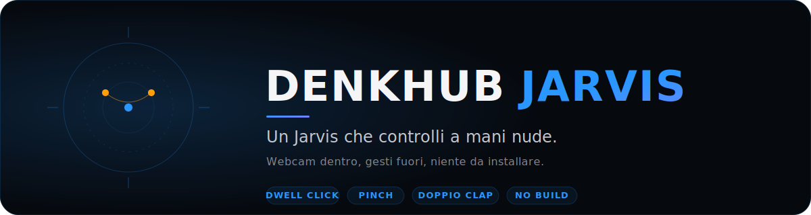

<p align="center">
  
</p>

<p align="center">
  <a href="https://denkhub-io.github.io/denkhub-jarvis/"><b>Demo live</b></a> &middot;
  <a href="docs/GESTURES.md">Gesti</a> &middot;
  <a href="docs/ADDING-AN-APP.md">Crea un'app</a> &middot;
  <a href="https://github.com/denkhub-io/clapper">Clapper</a>
</p>

---

## Cos'e

Un desktop virtuale nel browser che controlli con i gesti della mano davanti
alla webcam. Finestre fluttuanti, un dock di app, un HUD stile Iron Man, una
chat AI integrata e il **doppio clap** per aprire le tue app. JavaScript puro,
nessun build, nessun framework, nessuna installazione. Mouse e tastiera
funzionano comunque come ripiego.

L'interfaccia e in italiano.

## Come si controlla

Il punto sono le mani. Il cursore segue il **palmo**, quindi resta fermo
mentre pizzichi.

| Gesto | Azione |
|---|---|
| Mano aperta | Muovi il cursore |
| Punta e attendi (dwell) | Clicca, con anello di caricamento |
| Pinch (pollice e indice) | Seleziona |
| Pinch e tieni | Trascina una titlebar, ridimensiona da un angolo, scorri il corpo |
| Doppio pinch | Riapri l'ultima app |
| Doppio pugno (due mani) | Chiudi tutto, torna alla home |
| Doppio clap | Apri le app scelte, disposte in griglia |

Riferimento completo con le soglie in [docs/GESTURES.md](docs/GESTURES.md).

## Clapper

Batti le mani due volte e le app che hai scelto si aprono e si dispongono in
griglia sullo schermo. E la versione in-browser di
[denkhub-io/clapper](https://github.com/denkhub-io/clapper). Scegli le app, la
sensibilita e fai una prova dal pannello **Impostazioni > Clapper**. Tutto in
locale: l'audio del microfono non lascia il tuo computer.

## Avvio rapido

Non basta aprire `index.html` con un doppio clic: la webcam richiede un
contesto sicuro (`getUserMedia` gira solo su https o `http://localhost`), quindi
va servito via http. Scegli quello che hai:

```bash
git clone https://github.com/denkhub-io/denkhub-jarvis.git
cd denkhub-jarvis

# Python 3
python3 -m http.server 8000

# oppure Node
npx serve .

# oppure PHP
php -S localhost:8000
```

Apri `http://localhost:8000`, dai il permesso alla webcam e premi **ENTRA**.
Per Clapper serve anche il permesso al microfono (lo chiede quando lo attivi).

Usa un browser basato su Chromium per la resa migliore di MediaPipe Hands.

## Crea la tua app

Le app stanno in [`apps/`](apps), un file autonomo ciascuna, senza build.
Copia [`apps/hello-world.js`](apps/hello-world.js), rinominala, registrala e
aggiungi una riga `<script>` in `index.html`. Comparira nel dock. Guida
completa in [docs/ADDING-AN-APP.md](docs/ADDING-AN-APP.md) e
[CONTRIBUTING.md](CONTRIBUTING.md).

App incluse: Orologio, Note, Browser, AI Chat (Jarvis), Sistema, Impostazioni e
l'esempio Hello World.

## Tecnologia

- JavaScript puro, caricato con normali tag `<script>`. Niente bundler.
- [MediaPipe Hands](https://developers.google.com/mediapipe) per il tracking, da CDN.
- I token di brand DenkHub in `denkhub-kit/`.
- Sito statico su GitHub Pages.

## Privacy e chiave API

- **La webcam resta sul tuo computer.** I frame sono elaborati nel browser da
  MediaPipe. Nessun video viene caricato da nessuna parte.
- **Il microfono di Clapper resta locale.** Serve solo a sentire i clap.
- **L'AI Chat e opzionale.** Funziona solo se fornisci la tua chiave OpenAI.
  La chiave e salvata nel `localStorage` del tuo browser come `openai_api_key`
  e viene inviata solo a OpenAI quando chatti. Non e mai committata ne inviata
  a noi. Impostala da Impostazioni, oppure a mano:
  ```js
  localStorage.setItem('openai_api_key', 'sk-...')
  ```
- Non distribuiamo nessuna chiave. Non c'e nessun `.env`. Niente telemetria.

## Contribuire

Vedi [CONTRIBUTING.md](CONTRIBUTING.md). Buoni primi contributi: nuove app,
localizzazione in inglese, taratura dei gesti.

## Licenza

[MIT](LICENSE).
